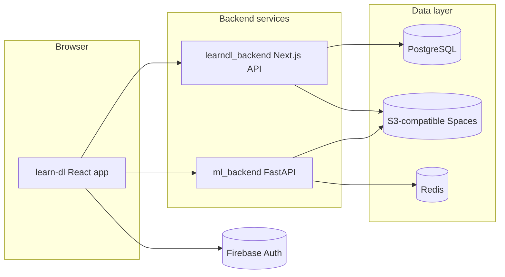

# LearnDL (Learn Deep Learning)

Contributors:
-  I-Hsuan Ho
-  Der-Chien Chang
-  Kuan-Yu Chang
-  Chia-Chun Wu

LearnDL is a full-stack web application for **text classification** aimed at learners: sign in, pick or upload a CSV, configure preprocessing and model settings, train a model asynchronously, inspect metrics and charts, keep a per-user **archive** of runs, and run **predictions** with attention-style visualizations.

This repository is organized as **three cooperating services**:

| Package | Role | Typical local URL |
|---------|------|-------------------|
| [`learn-dl/`](learn-dl/) | React + Vite SPA (UI, Firebase Auth client) | `http://localhost:5173` |
| [`learndl_backend/`](learndl_backend/) | Next.js API (users, datasets, sessions, presigned uploads) | `http://localhost:3000` |
| [`ml_backend/`](ml_backend/) | FastAPI + PyTorch training and inference | `http://localhost:8000` |

---

## Table of contents

1. [Architecture](#architecture)
2. [Prerequisites](#prerequisites)
3. [Environment variables](#environment-variables)
4. [Local setup (step by step)](#local-setup-step-by-step)
5. [How the web app works](#how-the-web-app-works)
6. [API reference (summary)](#api-reference-summary)
7. [Data formats and constraints](#data-formats-and-constraints)

---

## Architecture



- **Authentication:** The browser uses the Firebase client SDK. The Next.js backend verifies **Firebase ID tokens** with the Firebase Admin SDK and stores application users in PostgreSQL.
- **Metadata:** Datasets and training sessions (hyperparameters, stored metrics/visualization payloads) live in PostgreSQL via Prisma.
- **Large files:** CSV uploads use **presigned URLs** to DigitalOcean Spaces (S3-compatible API). The ML service reads training data from a URL or path and stores checkpoints in the same style of object storage (see `ml_backend` env vars).
- **Training progress:** The UI **polls** the ML service (`get_train_status`) on an interval; it does not use WebSockets or SSE in the current codebase.

---

## Prerequisites

- **Node.js** (compatible with Next 16 / Vite 7 — Node 20+ recommended)
- **npm**
- **Python 3** with `pip` (for `ml_backend`)
- **PostgreSQL 17** (local install or Docker)
- **Redis** (for `ml_backend` job status; local or Docker)
- **Firebase project** with Email/Password authentication enabled
- **DigitalOcean Spaces** (or compatible S3) credentials for dataset upload and ML artifacts — required for full upload/train/predict flows

Optional: **Docker** and **Docker Compose** for containerized Postgres/backend or ML service.

---

## Environment variables

### Frontend — `learn-dl/.env` (Vite prefix `VITE_`)

Create `learn-dl/.env` (or `.env.local`) with:

| Variable | Purpose |
|----------|---------|
| `VITE_FIREBASE_API_KEY` | Firebase Web API key |
| `VITE_FIREBASE_AUTH_DOMAIN` | Firebase auth domain |
| `VITE_FIREBASE_PROJECT_ID` | Firebase project ID |
| `VITE_FIREBASE_STORAGE_BUCKET` | Firebase storage bucket (Web config) |
| `VITE_FIREBASE_MESSAGING_SENDER_ID` | Firebase sender ID |
| `VITE_FIREBASE_APP_ID` | Firebase app ID |
| `VITE_API_URL` | Base URL for the Next API (default `http://localhost:3000/api`) |
| `VITE_ML_API_URL` | Full ML API base including path (default `http://localhost:8000/model_api`) |
| `VITE_IMDB_DATASET_URL` | HTTPS URL to built-in IMDB CSV (optional) |
| `VITE_SMS_DATASET_URL` | HTTPS URL to built-in SMS spam CSV (optional) |
| `VITE_AGNEWS_DATASET_URL` | HTTPS URL to built-in AG News CSV (optional) |

In **development**, Vite proxies requests under the ML API path to the origin derived from `VITE_ML_API_URL`, so the browser can call same-origin paths like `/model_api/...` while the dev server forwards to port 8000.

### Backend — `learndl_backend/.env.local`

| Variable | Purpose |
|----------|---------|
| `DATABASE_URL` | PostgreSQL connection string |
| `NEXT_PUBLIC_FIREBASE_*` | Must match the Firebase Web app (used where needed server-side) |
| `FIREBASE_PROJECT_ID` | Admin SDK project ID |
| `FIREBASE_CLIENT_EMAIL` | Admin SDK service account email |
| `FIREBASE_PRIVATE_KEY` | Admin SDK private key (use `\n` for newlines in `.env`) |
| `SPACES_KEY` / `SPACES_SECRET` / `SPACES_BUCKET` | DigitalOcean Spaces credentials and bucket |
| `CORS_ALLOWED_ORIGINS` | Optional comma-separated list; defaults include `http://localhost:5173` |

The S3 client in code targets the `tor1` DigitalOcean region endpoint; adjust code in `learndl_backend/lib/spaces.ts` if you use another region.

### ML service — `ml_backend/.env`

See [`ml_backend/.env.example`](ml_backend/.env.example):

| Variable | Purpose |
|----------|---------|
| `REDIS_HOST` | Redis hostname (default `localhost`) |
| `DO_REGION` | Spaces region |
| `DO_ENDPOINT` | Spaces endpoint URL |
| `DO_ACCESS_KEY` / `DO_SECRET_KEY` | Spaces keys |
| `DO_BUCKET_NAME` | Bucket for checkpoints and related objects |

---

## Local setup (step by step)

### 1. LearnDL backend (PostgreSQL + migrations + Next.js API)

Use Docker Compose from the backend folder so you do **not** need to run `npm install`, Prisma CLI, or `npm run dev` on the host for the API.

1. Create **`learndl_backend/.env.local`** with Firebase Admin (`FIREBASE_PROJECT_ID`, `FIREBASE_CLIENT_EMAIL`, `FIREBASE_PRIVATE_KEY`), the matching **`NEXT_PUBLIC_FIREBASE_*`** values, and DigitalOcean Spaces (`SPACES_KEY`, `SPACES_SECRET`, `SPACES_BUCKET`). For this Docker path, Compose injects `DATABASE_URL` for the `migrate` and `backend` services, so you do not need a host `localhost` database URL in that file unless you also run tools on the host.

2. From the backend directory, build and start Postgres, run migrations (with fallback to `db push` and seed), and start the API:

```bash
cd learndl_backend
docker compose up --build
```

3. **API base:** `http://localhost:3000` (REST routes under `/api/...`). Postgres is exposed on host port **5432** (`postgres` / `postgres`, database `learndl_db`).

### 3. ML service (`ml_backend`)

1. Create **`ml_backend/.env`** from **`ml_backend/.env.example`**: set `DO_REGION`, `DO_ENDPOINT`, `DO_ACCESS_KEY`, `DO_SECRET_KEY`, and `DO_BUCKET_NAME`. Keep **`REDIS_HOST=localhost`** so the app uses the Redis process started inside the Docker container (`start.sh`).

2. Build and run (Redis + Uvicorn on port **8000**; project folder is mounted for `--reload`):

```bash
cd ml_backend
docker compose up --build
```

- **API:** `http://localhost:8000`
- **OpenAPI docs:** `http://localhost:8000/docs`
- **ML routes:** `/model_api/...`

**Alternative (no Docker):** Python venv, `pip install -r requirements.txt`, Redis on the host, then `python -m api.main` or `uvicorn api.main:app --host 0.0.0.0 --port 8000 --reload`. See **`ml_backend/README.md`**.

### 4. Frontend (`learn-dl`)

```bash
cd learn-dl
npm install
# Create .env with VITE_* variables (see above)

npm run dev
```

Open `http://localhost:5173`. Log in or register on the welcome screen; authenticated users are redirected to **Training**.

**Order to start services:** PostgreSQL → `learndl_backend` → Redis → `ml_backend` → `learn-dl`.

---

## How the web app works

### Routes and navigation

The SPA uses React Router:

| Path | Access | Description |
|------|--------|---------------|
| `/` | Public | Welcome: login and signup (Firebase + backend registration) |
| `/training` | Protected | Main training workflow |
| `/prediction` | Protected | Inference against a completed session |
| `/archive` | Protected | History of runs with charts and previews |

The shell layout (`PageLayout`) provides navigation between Training, Prediction, and Archive, plus logout.

### Authentication flow

1. **Sign up:** Firebase `createUserWithEmailAndPassword`, optional display name, then `POST /api/auth/register` with the Firebase ID token. The app then signs the user out of Firebase locally so they complete a normal login afterward.
2. **Login:** Firebase `signInWithEmailAndPassword`, then `POST /api/auth/login` so the backend can associate the Firebase UID with the PostgreSQL user.
3. **Subsequent API calls:** Axios attaches `Authorization: Bearer <idToken>` from the current Firebase user (`learn-dl/src/api/axiosClient.ts`).
4. **Current user id:** `GET /api/auth/me` returns the Prisma user; the frontend uses `userId` for user-scoped routes.

### Training page

1. **Dataset selection:** Built-in options (IMDB, SMS Spam, AG News) use public CSV URLs from env. **Upload CSV** creates metadata via the Next API, receives a **presigned PUT URL**, and uploads the file directly to Spaces.
2. **Preprocessing:** Toggles for lowercase, punctuation, stopwords, lemmatization, plus URL/email handling modes (see `PreprocessingCard`).
3. **Model parameters:** Embedding choice among **BERT**, **DistilBERT**, and **RoBERTa**; epochs, batch size, learning rate (max 0.01), evaluation frequency, and fine-tuning mode (freeze all, unfreeze last N layers, unfreeze all).
4. **Classifier:** Type **GRU** or **LINEAR**, hidden size, dropout (slider).
5. **Start training:** The client calls the ML service `POST /model_api/train` with `user_id` and `training_session_id` query parameters and a JSON body aligned with `TrainingPayload` in `learn-dl/src/api/mlTraining.ts`.
6. **Progress:** The UI polls `GET /model_api/get_train_status` every few seconds until a terminal state (`completed`, `error`, or `cancelled`). Cancel uses `POST /model_api/cancel_train`.
7. **Persisting results:** On success, the frontend calls `PUT /api/users/:userId/training_sessions/store_result` to save hyperparameters and the visualization/metrics JSON returned by the ML service into PostgreSQL.

### Archive page

- Loads `GET /api/users/:userId/training_sessions` (enforced to match the authenticated user).
- Sidebar lists runs with model name, dataset filename, date, and accuracy string derived from stored metrics.
- Detail view shows dataset preview rows, configuration summary, and **`TrainingVisualizations`**: metric cards (accuracy, precision, recall, F1), confusion matrix, learning curves, attention visualization, and 2D embedding projection when present in stored JSON.
- Delete run: `DELETE` to the training session delete endpoint (and related cleanup as implemented server-side).

### Prediction page

- Lists the same completed training sessions.
- User enters text and runs `POST /model_api/model_output` with the full training config (including `class_map` from the run) so the ML service can load the correct checkpoint from object storage.
- Displays predicted label, top confidences, and attention visualization (`AttentionPanel`).

---

## API reference (summary)

### Next.js API (`/api/...`)

Base URL: `http://localhost:3000/api` (or your deployment host).

| Method | Path | Notes |
|--------|------|------|
| POST | `/auth/register` | Register app user after Firebase signup |
| POST | `/auth/login` | Session sync / lookup |
| POST | `/auth/logout` | Logout |
| GET | `/auth/me` | Current user |
| GET/PUT/PATCH/DELETE | `/users/me`, `/users/me/password`, `/users/me/delete` | Profile operations |
| GET | `/users/:userId/datasets` | Must match authenticated user |
| POST | `/users/:userId/datasets/upload` | Create dataset + presigned URLs |
| DELETE | `/users/:userId/datasets/delete` | Remove dataset |
| POST | `/users/:userId/datasets/reload` | Reload flow (see route implementation) |
| GET | `/users/:userId/training_sessions` | List sessions + metrics |
| PUT | `/users/:userId/training_sessions/store_result` | Save ML results |
| DELETE | `/users/:userId/training_sessions/delete` | Delete session |

Full detail: [`learndl_backend/README.md`](learndl_backend/README.md).

### ML API (`/model_api/...`)

Prefix on local dev: `http://localhost:8000/model_api`.

| Method | Path | Notes |
|--------|------|------|
| GET | `/health_check` | Liveness |
| POST | `/train` | Async training |
| GET | `/get_train_status` | Poll status and results |
| POST | `/cancel_train` | Cancel job |
| POST | `/model_output` | Predict |

Full request schemas and examples: [`ml_backend/README.md`](ml_backend/README.md).

---

## Data formats and constraints

- **CSV:** Two columns — text then label. The loader maps them to `input` and `output`. Rows with missing values are dropped.
- **Built-in datasets:** Must be reachable URLs your browser and ML service can read (CORS/network permitting for the frontend where applicable).
- **Checkpoints:** Stored under user/session-related keys in object storage; prediction requires a completed training run and matching configuration.
